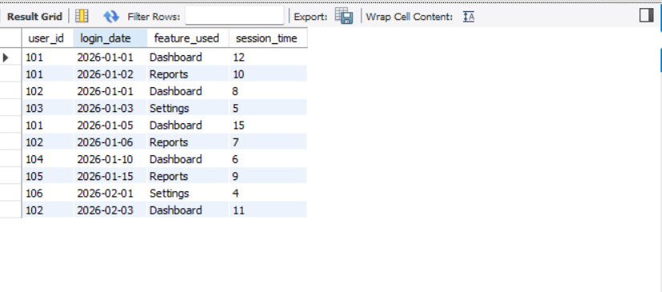

# Customer Churn Analysis using SQL

This project analyzes customer activity data to identify user engagement patterns and potential churn risk.

Dataset includes:
- user_id
- login_date
- feature_used
- session_time

Analysis performed:
- Identified most active users
- Found most used product features
- Calculated average session time
- Detected potential churn-risk users based on last login

Tools Used:
- MySQL

- SQL

## SQL Query Results

Example output from the dataset analysis:

